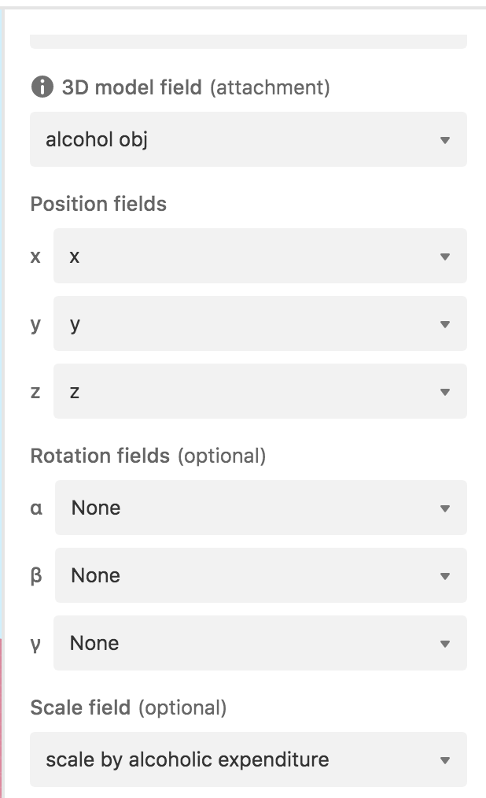

# Alcohol Consumption Scaling of Beers

## The Visualization:

Copied and pasted select west.xlcs data into [Airtable](https://airtable.com/shrneMCOWsCr7QWNd) to use [Blocks](https://support.airtable.com/hc/en-us/articles/115013403608-Getting-started-with-Airtable-blocks) feature that let's the user quickly make a simple 3D Virtual Reality Scene.

The scale of the beer is a function of how much the specific City spends on Alcohol, and I positioned the beers 3 units apart to make sort of a row.

I would have liked more time to:

- add lables
- more thoughtful approach to scaling. right now it's the relaltive spendings compared to average which doens't map perfectly to a volume.